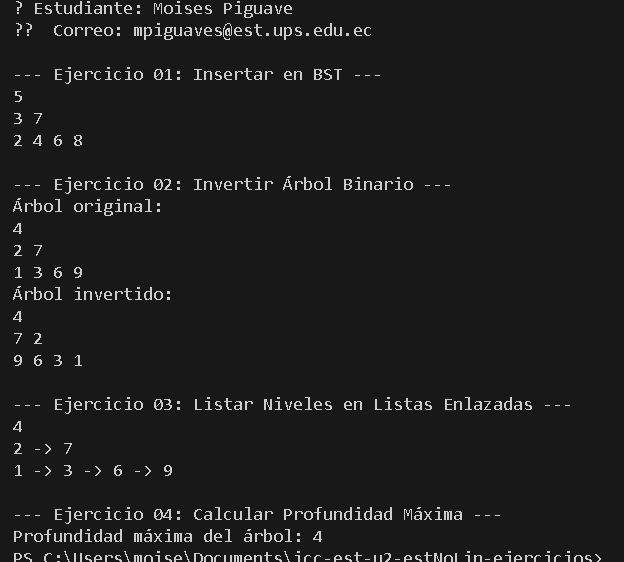

 **Ejercicio 1:** 
 Primero, para insertar un valor en un árbol binario, necesitamos crear un nodo que tenga atributos para su hijo izquierdo, derecho y el valor que va a contener. Luego, usamos un método de inserción que puede ser tanto simple como recursivo. Cuando insertamos, si el nodo actual está vacío (es decir, su valor es null), creamos un nuevo nodo con el valor proporcionado. Si no, comparamos el valor a insertar con el del nodo actual; si el valor es menor, se va hacia la izquierda, y si es mayor o igual, a la derecha. De esta forma, construimos el árbol agregando nodos en sus lugares correspondientes. Además, contamos con un método para imprimir el árbol y así poder mostrar su estructura.
 
 
 
  **Ejercicio 2:** 
  Invertir un árbol binario significa intercambiar sus ramas left y right en todos los niveles. Empezamos creando la estructura del nodo igual que antes, con atributos y un valor. Para invertir, usamos un método recursivo: primero verificamos si el nodo está vacío. Luego, guardamos temporalmente el valor del hijo izquierdo, y cambiamos sus hijos left y right, de modo que los elementos del lado izquierdo pasen al derecho y viceversa. Esto se repite en cada nivel haciendo llamadas recursivas. También hay un método para imprimir el árbol y poder visualizar cómo quedó tras la inversión. 
 
 
 
 **Ejercicio 3:**
  Para listar los nodos por niveles en listas enlazadas, primero creamos una clase Nodo con atributos para hijos izquierdo, derecho y su valor. En el método principal, usamos una cola para recorrer el árbol nivel por nivel, parecido a un recorrido BFS. Comenzamos añadiendo la raíz a la cola. Mientras la cola tenga elementos, sacamos el nodo del frente, guardamos su valor en una lista enlazada correspondiente a ese nivel, y luego agregamos sus hijos izquierdo y derecho a la cola para procesarlos en el siguiente paso. Al terminar, tenemos una lista que muestra todos los niveles del árbol, facilitando entender cómo están distribuidos los nodos según su profundidad.
 
 
 
 
  **Ejercicio 4:** 
  Calcular la profundidad máxima de un árbol binario significa determinar cuántos niveles tiene en total. Igual que antes, creamos la clase Nodo con sus atributos. El método principal usa recursión: por cada nodo, calcula la profundidad de sus subárboles izquierdo y derecho y toma el mayor de los dos, sumando uno para incluir el nivel actual. Cuando el nodo es null, la profundidad es cero. De esta forma, recorremos todo el árbol y obtenemos el número máximo de niveles, lo que corresponde a la profundidad máxima. Por último, la clase App es el punto de entrada del programa. Primero, muestra información del estudiante usando un validador externo (solo de referencia, no hay que modificar esto). Luego, crea los árboles con los valores de ejemplo y llama a los métodos correspondientes para insertar, invertir, listar niveles y calcular la profundidad. Finalmente, imprime los resultados en pantalla. Esto ayuda a comprobar que cada ejercicio funciona correctamente y a visualizar todo en un solo lugar.

