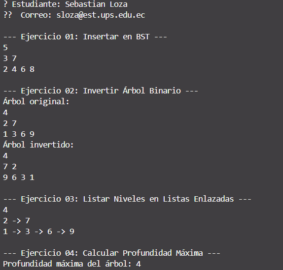

# 📄 Informe de Ejercicios sobre Árboles Binarios

**Alumno:** Sebastian Loza

**Fecha:** 2025-07-06

---

## Ejercicio 1: Inserción en Árbol Binario de Búsqueda

### Descripción  
Se implementa la inserción en un **árbol binario de búsqueda** (BST), donde:
- Todo nodo izquierdo contiene valores **menores** que su padre.  
- Todo nodo derecho contiene valores **mayores o iguales** al de su padre.

### Estructura del Nodo  
```java
public class Nodo {
    int valor;
    Nodo left, right;

    public Nodo(int valor) {
        this.valor = valor;
        this.left  = null;
        this.right = null;
    }
}
Algoritmo de Inserción (recursivo)
Caso base: si nodo == null, crea y retorna un nuevo Nodo(valorNuevo).

```

Comparación:

Si valorNuevo < nodo.valor, inserta en nodo.left.

Si valorNuevo ≥ nodo.valor, inserta en nodo.right.

```java
public Nodo insertar(Nodo nodo, int valorNuevo) {
    if (nodo == null) {
        return new Nodo(valorNuevo);
    }
    if (valorNuevo < nodo.valor) {
        nodo.left = insertar(nodo.left, valorNuevo);
    } else {
        nodo.right = insertar(nodo.right, valorNuevo);
    }
    return nodo;
}
Visualización
Recorrido in-order para imprimir los valores en orden ascendente:

java
Copiar
Editar
public void imprimirInOrder(Nodo nodo) {
    if (nodo == null) return;
    imprimirInOrder(nodo.left);
    System.out.print(nodo.valor + " ");
    imprimirInOrder(nodo.right);
}
```
---
## Ejercicio 2: Inversión del Árbol Binario

### Descripción
Invertir (reflejar) un árbol binario consiste en intercambiar recursivamente los subárboles izquierdo y derecho de cada nodo, obteniendo el “espejo” del árbol original.

Método Recursivo de Inversión
Si nodo == null, retorna inmediatamente.

Intercambia los punteros:

```java
Nodo temp   = nodo.left;
nodo.left   = nodo.right;
nodo.right  = temp;
Llama recursivamente sobre los subárboles intercambiados:
```
```java
invertir(nodo.left);
invertir(nodo.right);
```
```java
public void invertir(Nodo nodo) {
    if (nodo == null) return;
    // Swap children
    Nodo temp = nodo.left;
    nodo.left = nodo.right;
    nodo.right = temp;
    // Recurse
    invertir(nodo.left);
    invertir(nodo.right);
}
```
### Chequeo
#### Imprimir de nuevo con in-order o pre-order para observar el efecto espejo.
---
## Ejercicio 3: Listado de Nodos por Niveles (BFS)

### Descripción
Agrupar los nodos de cada nivel del árbol en una lista enlazada, equivalente a un recorrido por niveles (BFS).

Implementación con Cola
Inicializar Queue<Nodo> cola y añadir la raíz.

Mientras la cola no esté vacía:

Obtener int n = cola.size(); → número de nodos en el nivel actual.

Crear LinkedList<Integer> nivel.

Repetir n veces:

Nodo curr = cola.poll();

nivel.add(curr.valor);

Si curr.left != null, cola.offer(curr.left).

Si curr.right != null, cola.offer(curr.right).

Añadir nivel a List<LinkedList<Integer>> niveles.

```java
public List<LinkedList<Integer>> listarPorNiveles(Nodo raiz) {
    List<LinkedList<Integer>> niveles = new ArrayList<>();
    if (raiz == null) return niveles;

    Queue<Nodo> cola = new LinkedList<>();
    cola.offer(raiz);

    while (!cola.isEmpty()) {
        int n = cola.size();
        LinkedList<Integer> nivel = new LinkedList<>();
        for (int i = 0; i < n; i++) {
            Nodo curr = cola.poll();
            nivel.add(curr.valor);
            if (curr.left != null)  cola.offer(curr.left);
            if (curr.right != null) cola.offer(curr.right);
        }
        niveles.add(nivel);
    }
    return niveles;
}
```
### Resultado
#### Cada LinkedList en la colección corresponde a un nivel del árbol, listando los valores de izquierda a derecha.
---
## Ejercicio 4: Cálculo de Profundidad Máxima
### Descripción

Calcular la altura (profundidad máxima) del árbol, es decir, el número total de niveles desde la raíz hasta la hoja más profunda.

Algoritmo Recursivo
Caso base: si nodo == null, retorna 0.

Calcular recursivamente:
```java
int hL = profundidadMaxima(nodo.left);
int hR = profundidadMaxima(nodo.right);
return 1 + Math.max(hL, hR);
java
Copiar
Editar
public int profundidadMaxima(Nodo nodo) {
    if (nodo == null) return 0;
    int hL = profundidadMaxima(nodo.left);
    int hR = profundidadMaxima(nodo.right);
    return 1 + Math.max(hL, hR);
}
```
## Interpretación

El valor retornado representa la cantidad de niveles, contando la raíz como nivel 1.

🚀 Clase Principal y Flujo de Ejecución
App.java — punto de entrada.

Muestra los datos del estudiante (ej. usando un validador externo).

Crea ejemplos de árboles con valores predeterminados.

## Invoca en secuencia:
```
insertar(...)

invertir(...)

listarPorNiveles(...)

profundidadMaxima(...)
```
Imprime en consola los resultados de cada ejercicio.

Este diseño modular permite probar cada funcionalidad de forma aislada y luego junto en un único flujo de trabajo.

## Conclusión
Estos cuatro ejercicios abarcan las operaciones fundamentales sobre árboles binarios:

Inserción en BST (mantiene orden).

Inversión (genera el espejo).

Recorrido por niveles (agrupa nodos por profundidad).

Cálculo de altura (profundidad máxima).

La implementación recursiva no solo simplifica el código, sino que también refuerza la comprensión profunda de los algoritmos sobre estructuras dinámicas como los árboles.

## Salida de la Terminal

